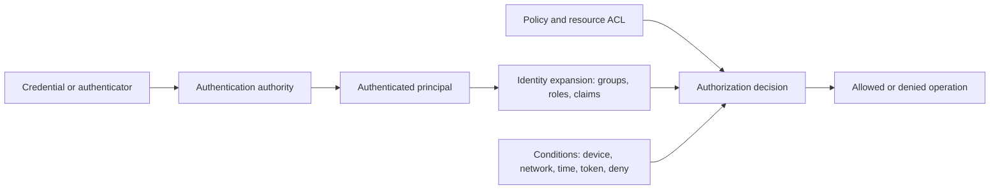

# Authentication, authorization, and effective access

## Core distinction

Authentication establishes a claim about identity. Authorization decides what that identity may do to a resource. Effective access is the result after identity expansion, policy, inheritance, explicit denies, conditions, resource state, network reachability, token properties, and enforcement behavior are applied.

A successful login is not evidence of authorization. A listed permission is not proof it is usable. A usable permission is not automatically a meaningful security-boundary crossing.

## Assessment model

For each path record:

1. **Principal:** user, computer, service account, process token, application, managed identity, or anonymous identity.
2. **Authenticator:** password-derived secret, key, certificate, token, ticket, device proof, or external assertion.
3. **Authority:** local OS, domain controller, KDC, identity provider, application, or cloud control plane.
4. **Authorization data:** groups, SIDs, roles, claims, scopes, ACL entries, policy, and conditions.
5. **Enforcement point:** kernel, service, API gateway, directory, resource provider, or application.
6. **Operation and target:** exact action, resource, and scope.
7. **Result and evidence:** allowed, denied, partial, theoretical, or blocked.

## Common audit mistakes

- Treating group membership as effective access without nested-group and deny evaluation.
- Treating ownership as harmless when ownership permits ACL modification.
- Confusing a token's audience or scope with the permissions assigned to its principal.
- Assuming an administrator label creates identical rights across local, domain, directory, and cloud scopes.
- Declaring a path exploitable without confirming target existence, reachability, authentication mode, and environmental controls.
- Declaring a control effective from configuration alone without testing the enforcement point.

## Evidence questions

- Which principal did the service authenticate?
- Which protocol and credential type were used?
- Which authority validated the authentication?
- What authorization data reached the enforcement point?
- Were identities or roles expanded transitively?
- Did explicit deny, policy, conditional access, integrity level, or resource state alter the result?
- Was the operation tested, inferred, or only statically observed?

## Cross-platform validation pattern

Windows often exposes identity through access tokens, SIDs, group attributes, privileges, security descriptors, and service-specific policy. Linux commonly uses numeric UIDs/GIDs, supplementary groups, file modes, ACLs, capabilities, PAM/session policy, and daemon-specific authorization. Cloud systems add token audience, OAuth scopes, roles, resource scope, conditions, and separate data planes.

The invariant is the same: evaluate the exact principal, operation, target, and enforcement point.

## References

- Microsoft, [Windows authentication concepts](https://learn.microsoft.com/en-us/windows-server/security/windows-authentication/windows-authentication-concepts), accessed 2026-07-27.
