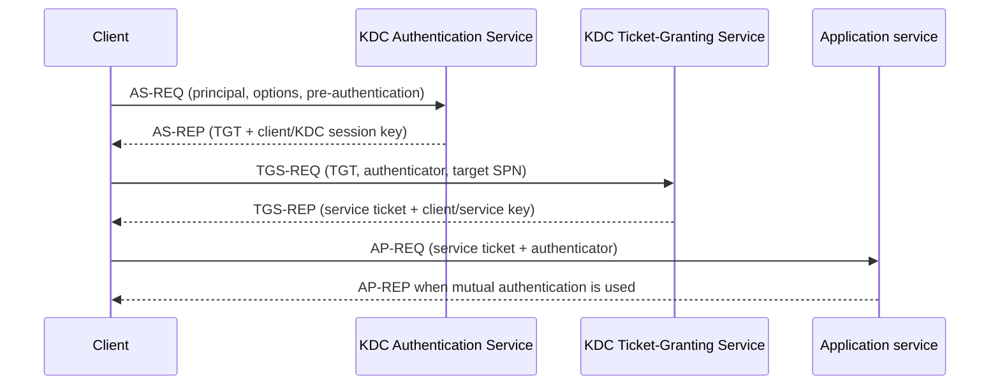

# Kerberos protocol and ticket flow

## Why it matters

Kerberos authenticates principals with tickets and shared-key cryptography. Most AD Kerberos attack paths are consequences of who controls a long-term key, which ticket fields a KDC will issue, which service accepts a ticket, and what authorization data the service trusts.

## Components and keys

- **Client principal:** requests tickets and proves knowledge of a key during pre-authentication when required.
- **KDC:** the Authentication Service and Ticket-Granting Service, implemented by AD domain controllers.
- **TGT:** ticket for the `krbtgt` service plus a client/KDC session key.
- **Service ticket:** ticket for an SPN plus a client/service session key.
- **Long-term keys:** derived from passwords or backed by other credential material; encryption-type support matters.
- **PAC:** Windows authorization data commonly carried in tickets. A PAC is not the same thing as the ticket itself.



The TGT is encrypted for the KDC's `krbtgt` key. A service ticket is encrypted for the target service account's key. The client does not decrypt either ticket body; it uses separately returned session keys.

## Boundary questions

- Which principal and realm are named?
- Which SPN identifies the service?
- Which account owns that SPN and therefore supplies the service-ticket key?
- Which encryption type and key version were used?
- Is pre-authentication required?
- What delegation and ticket flags apply?
- Which PAC data is present, who signed it, and does the service validate it?
- Is authentication crossing a domain or forest trust?

## Windows enumeration

**Risk:** local/read-only or authenticated/low-noise. **Verification:** syntax-verified; target execution untested.

```powershell
klist.exe
klist.exe tgt
klist.exe sessions

$DomainController = "<dc-fqdn>"
Get-ADDomain -Server $DomainController |
    Select-Object DNSRoot, DomainMode, PDCEmulator

Get-ADUser -LDAPFilter '(servicePrincipalName=*)' -Server $DomainController -Properties servicePrincipalName,msDS-SupportedEncryptionTypes,PasswordLastSet,Enabled | Select-Object SamAccountName,Enabled,PasswordLastSet,msDS-SupportedEncryptionTypes,servicePrincipalName
```

An SPN-bearing account is a Kerberos service identity; it is not automatically vulnerable. Password strength, key management, encryption types, service criticality, and reachable ticket requests determine risk.

## Linux enumeration

```bash
DOMAIN="<domain-fqdn>"
REALM="<KERBEROS-REALM>"
USERNAME="<username>"
DC_FQDN="<dc-fqdn>"

dig +short SRV "_kerberos._tcp.${DOMAIN}"
kinit "${USERNAME}@${REALM}"
klist -ef
kvno "<service>/<host-fqdn>@${REALM}"
klist -ef
```

`kvno` requests a service ticket for the specified principal and is useful for controlled protocol validation. It generates normal KDC activity and should target an approved SPN.

## NetExec context validation

```bash
DC_FQDN="<dc-fqdn>"
DOMAIN="<domain-fqdn>"
USERNAME="<username>"

nxc ldap "${DC_FQDN}" -d "${DOMAIN}" -u "${USERNAME}" -k --use-kcache
nxc ldap --help
```

Check installed help because Kerberos-cache flags and behavior are version sensitive. Confirm with `klist` which cache and principal are active; a tool reporting success does not prove which ticket or DNS/SPN path it used unless captured in evidence.

## Expected observations

- TGT cache entry for the realm's `krbtgt` principal.
- Service-ticket entry matching the exact SPN requested.
- Encryption and flags appropriate to the domain/account policy.
- KDC or service errors that preserve the distinction between unknown principal, expired ticket, clock skew, unsupported encryption, and authorization denial.

## Common failures

| Error class | Interpretation |
|---|---|
| Clock skew | Client, KDC, or service time exceeds permitted tolerance |
| Principal unknown | SPN/UPN/realm mismatch or missing registration |
| Modified/bad integrity | Wrong service key, duplicate SPN, key-version mismatch, or malformed ticket |
| Unsupported encryption | Client, account, domain, or policy encryption-type mismatch |
| Authentication succeeds but access fails | Kerberos worked; authorization or application policy denied the operation |

## Audit implications

Review SPN ownership, duplicate SPNs, pre-authentication exceptions, service-account credential hygiene, encryption-type policy, delegation, privileged accounts, trust behavior, and ticket lifetime. Keep roasting, delegation abuse, and ticket forgery in separate technique pages linked back to this mechanism.

## References

- Microsoft, [Kerberos authentication overview in Windows Server](https://learn.microsoft.com/en-us/windows-server/security/kerberos/kerberos-authentication-overview), updated 2025-07-17, accessed 2026-07-27.
- Microsoft, [Kerberos authentication troubleshooting guidance](https://learn.microsoft.com/en-us/troubleshoot/windows-server/windows-security/kerberos-authentication-troubleshooting-guidance), accessed 2026-07-27.
