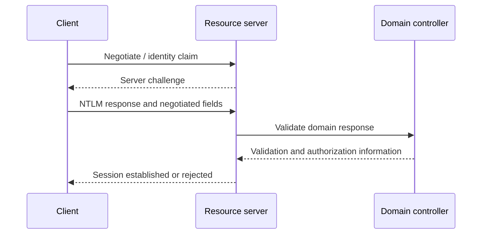

# NTLM authentication and relay boundaries

## Mechanism

NTLM is a challenge-response family. The client proves knowledge of password-derived key material without sending the password. For a domain account, the target server commonly relies on a domain controller to validate the response; for a local account, it can validate against the local account database.



The NT hash, an NTLM challenge-response value, and a NetNTLM capture are not interchangeable artefacts. Pass-the-hash uses password-equivalent key material in supported authentication flows. Offline cracking targets captured challenge-response material. Relay forwards an authentication exchange to another service and depends on binding and integrity protections at both ends.

## Relay boundary model

Relay risk exists when an attacker can induce or intercept authentication and the destination accepts that authentication without adequately binding it to the intended server/channel or requiring message integrity the attacker cannot satisfy.

Evaluate together:

- coercion or capture opportunity;
- protocol and authentication negotiation;
- SMB or LDAP signing requirements;
- Extended Protection for Authentication and channel binding;
- TLS termination and certificate validation;
- target account privileges and target operation;
- local-account restrictions and credential reuse;
- whether NTLM is permitted at all.

Do not label a host relayable from one signing flag alone.

## Windows enumeration

**Risk:** local/read-only. **Verification:** syntax-verified; policy interpretation is version dependent.

```powershell
Get-SmbClientConfiguration |
    Select-Object EnableSecuritySignature, RequireSecuritySignature

Get-SmbServerConfiguration |
    Select-Object EnableSecuritySignature, RequireSecuritySignature, EncryptData

Get-ItemProperty -Path 'HKLM:\SYSTEM\CurrentControlSet\Control\Lsa\MSV1_0' -ErrorAction SilentlyContinue |
    Select-Object RestrictSendingNTLMTraffic, AuditReceivingNTLMTraffic

Get-WinEvent -FilterHashtable @{LogName='Microsoft-Windows-NTLM/Operational'} -ErrorAction SilentlyContinue |
    Select-Object -First 100 TimeCreated, Id, LevelDisplayName, Message
```

Registry presence and numeric values require mapping to the applicable Windows version and policy documentation. Absence can mean default behavior, not necessarily a secure or insecure state.

## Linux and NetExec discovery

```bash
TARGETS="<authorized-target-or-file>"

nxc smb "${TARGETS}" --gen-relay-list relay-candidates.txt
nxc smb --help
```

**Risk:** authenticated or unauthenticated network enumeration; potentially noticeable at scale. **Verification:** option must be confirmed with installed `nxc smb --help`; target execution untested.

The generated list is a candidate list based on the tool's checks. It does not establish LDAP relayability, EPA/channel-binding state, coercion reachability, privileges of a coerced identity, or a useful post-authentication operation.

Native protocol checks can supplement tool output:

```bash
TARGET="<target-fqdn>"

nmap -Pn -p445 --script smb2-security-mode "${TARGET}"
openssl s_client -connect "${TARGET}:636" -servername "${TARGET}" </dev/null
```

Nmap script output describes observed SMB signing negotiation. TLS inspection does not by itself reveal LDAP channel-binding enforcement.

## Evidence and interpretation

For each endpoint retain protocol, signing requirement, TLS path, authentication mechanism, EPA/channel-binding evidence, account class, source of forced authentication if tested, and the exact authorized operation that could cross a boundary. Mark untested coercion and privilege assumptions explicitly.

## Defensive validation

- Inventory NTLM use before restriction.
- Require signing where the protocol supports it.
- Deploy EPA/channel binding according to service guidance.
- Remove name-resolution poisoning opportunities and unnecessary coercion surfaces.
- Prevent privileged identities from authenticating to lower-trust systems.
- Eliminate local-administrator password reuse.
- Prefer Kerberos with correct SPNs and DNS.
- Validate enforcement with representative clients before broad rollout.

## References

- Microsoft, [NTLM overview](https://learn.microsoft.com/en-us/windows-server/security/kerberos/ntlm-overview), updated 2025-04-18, accessed 2026-07-27.
- Microsoft, [[MS-NLMP]: NT LAN Manager (NTLM) Authentication Protocol](https://learn.microsoft.com/en-us/openspecs/windows_protocols/ms-nlmp/), accessed 2026-07-27.
- NetExec, [Selecting and using a protocol](https://www.netexec.wiki/getting-started/selecting-and-using-a-protocol), accessed 2026-07-27. Syntax source only.
