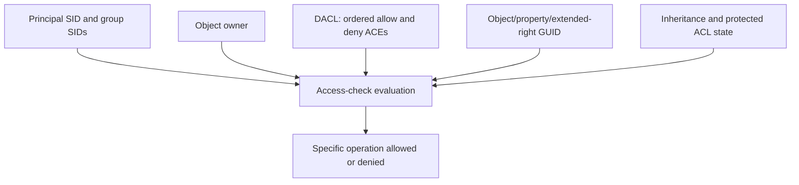

# Active Directory security descriptors and effective rights

## Why it matters

AD authorization is enforced through security descriptors on directory objects. Attack-path analysis depends on resolving ownership, DACL entries, inherited rights, object-specific GUIDs, group expansion, and the exact operation. A friendly name such as `GenericAll` is a tool interpretation, not the raw stored permission.

## Security descriptor model

- **Owner:** can normally change the DACL even when no explicit allow ACE grants that operation.
- **DACL:** ACEs that allow or deny access. A null DACL and an empty DACL have radically different meanings.
- **SACL:** audit and mandatory-control information; reading it generally requires additional privilege.
- **ACE trustee:** SID of the principal to which an entry applies.
- **Access mask:** rights such as generic, standard, directory-service, and control-access rights.
- **Object type GUID:** can restrict an ACE to a property, property set, validated write, or extended right.
- **Inheritance:** depends on flags, object class, container hierarchy, and protected ACL behavior.



## Boundary-crossing examples

- Modify group membership of a privileged group.
- Reset another principal's password.
- Write an SPN, key credential, delegation attribute, or logon script.
- Modify a GPO or link that affects higher-trust systems.
- Take ownership and then rewrite the DACL.
- Obtain replication rights sufficient for directory secret replication.

Every example requires operation-specific validation. A write to one attribute does not imply control over all attributes.

## Windows — inspect one object's descriptor

**Risk:** authenticated, low-noise. **Verification:** syntax-verified; target execution untested.

```powershell
$DomainController = "<dc-fqdn>"
$Identity = "<distinguished-name-or-ad-identity>"

$Object = Get-ADObject -Identity $Identity -Server $DomainController -Properties nTSecurityDescriptor
$Acl = Get-Acl -Path ("AD:\" + $Object.DistinguishedName)

$Acl | Select-Object Owner, AreAccessRulesProtected
$Acl.Access | Select-Object IdentityReference, AccessControlType,
    ActiveDirectoryRights, ObjectType, InheritedObjectType, IsInherited,
    InheritanceType
```

The `AD:` provider requires the ActiveDirectory module/provider context. Resolve GUIDs against the schema and configuration partitions rather than guessing their meaning.

Inventory explicitly interesting non-inherited rights for later analysis:

```powershell
$SearchBase = "<distinguished-name>"

Get-ADObject -LDAPFilter '(objectClass=*)' -SearchBase $SearchBase -Server $DomainController -Properties nTSecurityDescriptor |
    ForEach-Object {
        $CurrentObject = $_
        $CurrentAcl = Get-Acl -Path ("AD:\" + $CurrentObject.DistinguishedName)
        foreach ($Ace in $CurrentAcl.Access) {
            if (-not $Ace.IsInherited) {
                [pscustomobject]@{
                    ObjectDN = $CurrentObject.DistinguishedName
                    Trustee = $Ace.IdentityReference
                    Type = $Ace.AccessControlType
                    Rights = $Ace.ActiveDirectoryRights
                    ObjectType = $Ace.ObjectType
                    InheritanceType = $Ace.InheritanceType
                }
            }
        }
    } | Export-Csv -NoTypeInformation -Encoding UTF8 -Path '.\ad-explicit-aces.csv'
```

This can be expensive and noisy in a large search base. Scope by OU/object class, measure first, and preserve paging/error conditions. It does not calculate effective access.

## Linux — retrieve raw security descriptors

LDAP access to `nTSecurityDescriptor` uses the security-descriptor flags control when selecting owner, group, DACL, or SACL portions. Tool support varies. Prefer a collector that preserves raw descriptors and object GUID mappings, then independently validate high-impact edges.

NetExec is useful for reachability and collector orchestration but its default LDAP output is not a complete ACL audit:

```bash
DC_FQDN="<dc-fqdn>"
DOMAIN="<domain-fqdn>"
USERNAME="<username>"

nxc ldap "${DC_FQDN}" -d "${DOMAIN}" -u "${USERNAME}" -p '<password>'
nxc ldap --help
```

For graph collection, consult the installed collector's help and pin its version. Record collection methods, excluded properties, LDAP errors, and whether ACLs, containers, trusts, sessions, and local groups were collected. Never equate a graph edge with validated exploitability.

## Effective-rights validation checklist

1. Resolve the trustee SID and nested membership at collection time.
2. Identify owner and protected/inherited ACL state.
3. Resolve access mask and any object-type GUID.
4. Identify the exact operation required for the proposed path.
5. Evaluate explicit deny and scope/inheritance effects.
6. Confirm the target object exists and is security relevant.
7. Confirm the acting principal can authenticate to the enforcement point.
8. Identify controls that prevent the operation or its consequence.
9. If approved, validate with the least-invasive reversible action.
10. Restore state and independently confirm the descriptor/value.

## Evidence

Retain object GUID and DN, descriptor or relevant ACEs, owner, inheritance state, trustee SID, SID-to-name resolution, group-expansion basis, GUID mapping source, collection DC/time, proposed operation, validation state, and blockers.

## References

- Microsoft, [Access control model](https://learn.microsoft.com/en-us/windows/win32/secauthz/access-control-model), accessed 2026-07-27.
- Microsoft, [Get-ADObject](https://learn.microsoft.com/en-us/powershell/module/activedirectory/get-adobject), accessed 2026-07-27.
