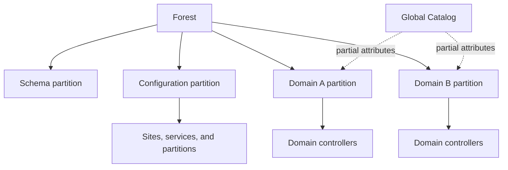

# Active Directory structure and discovery

## Purpose

Establish the forest, domains, naming contexts, domain controllers, sites, trusts, functional levels, and current collection context before deeper enumeration. This is the coverage map for every later AD check.

## Internal model

An AD forest shares schema and configuration partitions. Each domain has its own domain naming context. Domain controllers also expose RootDSE, which advertises naming contexts, capabilities, server identity, and directory time. The Global Catalog holds a partial attribute set for objects across forest domains; it is not a complete substitute for querying each domain naming context.



## Preconditions

- DNS resolution to the target domain or DC.
- Correct time for Kerberos-authenticated operations.
- TCP 389 or 636 for LDAP/LDAPS; Global Catalog commonly uses 3268 or 3269.
- A domain account for reliable authenticated enumeration. Anonymous RootDSE visibility is environment dependent.

## Windows — PowerShell with the AD module

**Risk:** authenticated, low-noise. **Verification:** syntax-verified against Microsoft documentation; target execution untested.

```powershell
$DomainController = "<dc-fqdn>"

$RootDse = Get-ADRootDSE -Server $DomainController -Properties *
$Forest = Get-ADForest -Server $DomainController
$Domain = Get-ADDomain -Server $DomainController

$RootDse | Select-Object dnsHostName, defaultNamingContext,
    configurationNamingContext, schemaNamingContext, rootDomainNamingContext,
    domainFunctionality, forestFunctionality, supportedCapabilities

$Forest | Select-Object Name, RootDomain, Domains, GlobalCatalogs, Sites,
    ForestMode, DomainNamingMaster, SchemaMaster

$Domain | Select-Object DNSRoot, NetBIOSName, DistinguishedName, DomainMode,
    PDCEmulator, RIDMaster, InfrastructureMaster, ReplicaDirectoryServers,
    ReadOnlyReplicaDirectoryServers
```

Expected output identifies the queried DC and the forest/domain topology. An access error is not proof that an object is absent. A server-selection error commonly indicates DNS, reachability, AD Web Services, or authentication context problems.

Enumerate DCs, sites, and trusts:

```powershell
Get-ADDomainController -Filter * -Server $DomainController |
    Select-Object HostName, Domain, Forest, Site, IPv4Address, IsGlobalCatalog,
        IsReadOnly, OperatingSystem

Get-ADReplicationSite -Filter * -Server $DomainController |
    Select-Object Name, DistinguishedName

Get-ADTrust -Filter * -Server $DomainController -Properties * |
    Select-Object Name, Direction, TrustType, ForestTransitive, SelectiveAuthentication,
        SIDFilteringForestAware, SIDFilteringQuarantined
```

`Get-ADTrust` exposes configured trust properties; it does not by itself prove reachability, usable credentials, SID-filter behavior in practice, or a boundary crossing.

## Windows — built-in discovery without the AD module

```powershell
$Domain = "<domain-fqdn>"

Resolve-DnsName -Type SRV "_ldap._tcp.dc._msdcs.$Domain"
Resolve-DnsName -Type SRV "_kerberos._tcp.$Domain"
nltest.exe /dsgetdc:$Domain
nltest.exe /domain_trusts /all_trusts
```

DNS records are discovery data, not authoritative proof that a DC is alive or correctly configured. `nltest` reflects the current host and security context.

## Linux — DNS and LDAP

```bash
DOMAIN="<domain-fqdn>"
DC_FQDN="<dc-fqdn>"

dig +short SRV "_ldap._tcp.dc._msdcs.${DOMAIN}"
dig +short SRV "_kerberos._tcp.${DOMAIN}"

ldapsearch -LLL -x -H "ldap://${DC_FQDN}" -s base -b "" \
  defaultNamingContext configurationNamingContext schemaNamingContext \
  rootDomainNamingContext dnsHostName supportedCapabilities
```

The simple `-x` RootDSE query is unauthenticated. If anonymous reads are restricted, use approved SASL/GSSAPI or LDAPS/simple-bind authentication and avoid placing passwords directly on the command line.

After obtaining a Kerberos ticket:

```bash
DOMAIN="<domain-fqdn>"
USERNAME="<username>"
DC_FQDN="<dc-fqdn>"

kinit "${USERNAME}@${DOMAIN^^}"
klist
ldapsearch -LLL -Y GSSAPI -H "ldap://${DC_FQDN}" -s base -b "" \
  defaultNamingContext configurationNamingContext schemaNamingContext
```

Kerberos realm capitalization is conventional but realm configuration is authoritative. GSSAPI failures may reflect DNS canonicalization, SPN, clock, realm, or ticket-cache issues—not invalid credentials alone.

## Linux — NetExec

**Verification:** syntax-verified at the protocol-selection level; module/flag availability must be checked against the installed version.

```bash
DC_FQDN="<dc-fqdn>"
DOMAIN="<domain-fqdn>"
USERNAME="<username>"

nxc ldap "${DC_FQDN}" -d "${DOMAIN}" -u "${USERNAME}" -p '<password>'
nxc ldap --help
```

Prefer a protected credential mechanism supported by the engagement environment. Treat the successful bind, reported domain, and signing/TLS information as observations. Use explicit LDAP queries or another collector for attributes not shown by NetExec's default output.

## Evidence checklist

- Queried DC and its IP address.
- Root, domain, configuration, and schema naming contexts.
- Forest and domain functional levels.
- All discovered domains and DCs, with Global Catalog and RODC status.
- Sites and trust directions/types.
- Unreachable domains/DCs and insufficient-permission conditions.
- Authentication method, source identity, tool version, and time.

## Failure modes

| Symptom | Likely causes | Next check |
|---|---|---|
| LDAP timeout | routing, firewall, wrong address | TCP reachability and DNS result |
| Strong-auth-required | unsigned/simple LDAP rejected | LDAPS or SASL signing/binding |
| Kerberos principal error | DNS/SPN/realm mismatch | forward/reverse DNS, `klist`, SPN |
| Partial domain list | GC-only collection or permissions | query each domain naming context |
| Empty result | filter/base error or denied read | inspect LDAP result code and base DN |

## References

- Microsoft, [Get-ADRootDSE](https://learn.microsoft.com/en-us/powershell/module/activedirectory/get-adrootdse), accessed 2026-07-27.
- Microsoft, [Get-ADForest](https://learn.microsoft.com/en-us/powershell/module/activedirectory/get-adforest), accessed 2026-07-27.
- NetExec, [Selecting and using a protocol](https://www.netexec.wiki/getting-started/selecting-and-using-a-protocol), accessed 2026-07-27. Syntax source only.
